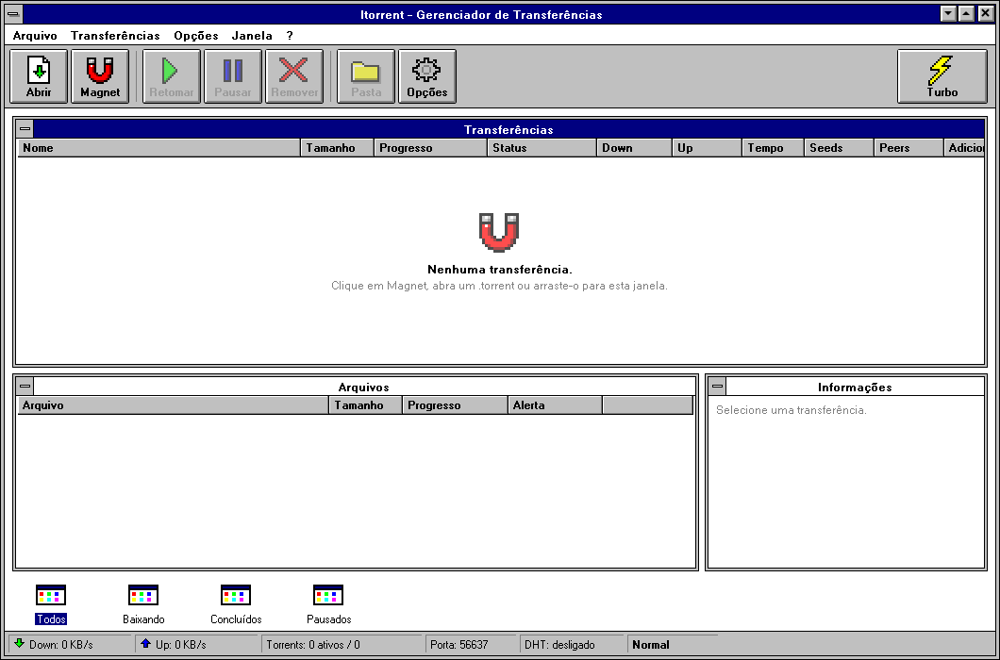
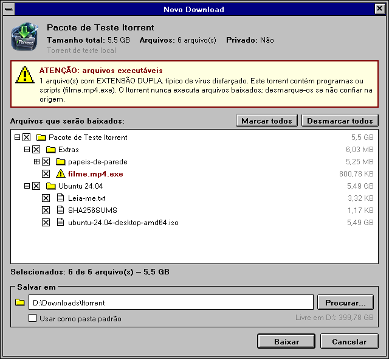

<p align="center">
  
</p>

<h1 align="center">Itorrent</h1>

<p align="center">
  <b>Um cliente BitTorrent sem anúncios, sem surpresas e com cara de Windows 3.1.</b><br/>
  Feito porque eu cansei de não confiar no programa que roda no meu próprio PC.
</p>

<p align="center">
  
  
  
  
  
</p>

<p align="center">
  
</p>

---

## Por que eu criei o Itorrent

Eu não queria mais usar software em que eu não confiava.

Os clientes de torrent que eu usava tinham virado uma vitrine de propaganda: banner na tela, "ofertas" no instalador, coisas rodando em segundo plano que eu nunca pedi. Pior do que os anúncios era a instabilidade: o programa **desconectava sozinho**, travava no meio do download e soltava **erro atrás de erro** sem explicar nada. E no fim eu não sabia o que aquele executável fazia com a minha rede e com os meus arquivos.

Então decidi fazer o meu, com algumas regras que não negocio:

| O que me incomodava | Como o Itorrent resolve |
|---|---|
| Banners, "ofertas" no instalador, programas extras | **Zero anúncios, zero telemetria, zero "ofertas".** O app não manda nada pra lugar nenhum além do próprio BitTorrent. |
| Não saber o que o executável faz | **Código aberto.** Se eu (ou você) quiser saber o que ele faz, está tudo aqui. |
| Desconexões e erros sem explicação | **Estável e previsível.** Mostra o que está acontecendo, registra erros em log e volta exatamente de onde parou. |
| Medo do que o programa expõe na rede | **Seguro por padrão.** A única porta aberta é a do BitTorrent, e ele nunca executa nada que baixa. |

## A estética: por que parece Windows 3.1

<p align="center">
  
</p>

O visual é uma homenagem proposital ao **Gerenciador de Programas do Windows 3.1** e aos clientes P2P do começo dos anos 2000, como o **eMule**. Não é só nostalgia: aquela época tinha uma ideia de software que eu queria de volta.

- **Software honesto.** Programa daquela época abria, fazia o trabalho e saía da frente. Sem feed, sem notificação pedindo nota, sem tela de "novidades". O Itorrent segue essa linha.
- **Tudo à vista.** Botões em relevo que parecem botões, menus com texto em vez de ícones misteriosos, barra de status mostrando velocidade, porta e DHT o tempo todo. Você sempre sabe o que o programa está fazendo.
- **Leve.** Sem animações pesadas, transparências ou navegador embutido. A interface atualiza uma vez por segundo e pronto.
- **Charme.** Um torrent client novo que parece ter saído de um disquete de 1992 é simplesmente divertido de usar.

Detalhes recriados à mão:

| Elemento | Inspiração | Como ficou no Itorrent |
|---|---|---|
| Barra de título | Windows 3.1 | Azul-marinho, título centralizado, **caixa de controle** à esquerda (clique duplo fecha a janela) e botões ▼ ▲ ✕ em relevo. |
| Painéis internos | Gerenciador de Programas | Transferências, Arquivos e Informações são "janelas de grupo"; a ativa fica com o título em azul. |
| Ícones de grupo no rodapé | Gerenciador de Programas | Funcionam como filtros: Todos, Baixando, Concluídos e Pausados. |
| Barra de ferramentas | eMule | Botões grandes com ícone e texto embaixo; o **Turbo** fica afundado quando ligado. |
| Ícones | Paleta VGA de 16 cores | Pixel-art 16×16 desenhado em código, ampliado sem suavização. |
| Caixas de seleção | Windows 3.1 | Marcadas com **X** em vez de ✓; pastas parcialmente marcadas ficam cinza. |
| Barras de rolagem | Windows 3.1 | Setas em relevo e "alça" quadrada de tamanho fixo. |
| Menus | Windows 3.1 | Fundo branco, destaque azul-marinho e sombra preta sólida. |
| Barra de progresso | Cópia de arquivos do 3.1 | Azul com **texto invertido**: branco sobre a parte preenchida, preto sobre o resto. |
| Árvore de arquivos | Gerenciador de Arquivos | Caixinhas `+` / `−` para abrir pastas e ícones de pasta amarela. |
| Fonte | MS Sans Serif | Microsoft Sans Serif em negrito nos menus e botões, renderizada sem antialiasing. |

Por baixo do visual antigo está tudo moderno: .NET 10, WPF, suporte a alta resolução (DPI) e um motor BitTorrent atual.

## O que ele faz

| Recurso | Descrição |
|---|---|
| Adicionar torrents | Por link magnet, arquivo `.torrent`, arrastar e soltar ou clique no navegador. |
| Escolher antes de baixar | Mostra todos os arquivos numa árvore; você desmarca o que não quer, escolhe a pasta e vê o espaço livre no disco. |
| Alerta de executáveis | Avisa quando o torrent tem `.exe`, `.bat`, `.scr`, `.lnk`… e destaca extensão dupla (`filme.mp4.exe`). |
| Modo Turbo | Um botão que aplica de uma vez todos os ajustes de velocidade (veja abaixo). |
| Parar de semear ao concluir | Para o torrent quando termina, mantendo os arquivos. Durante o download o upload continua, porque o BitTorrent recompensa quem envia. |
| Estatísticas | Progresso, velocidade, tempo restante, seeds e peers no formato `12 (340)`: 12 conectados a você, 340 na rede. |
| Segundo plano | Fechar (✕) só esconde a janela. Pausar tudo, Retomar tudo e Sair ficam no ícone da bandeja. |
| Retomada | Volta de onde parou depois de fechar o app ou reiniciar o PC. |
| Notificação | Aviso do Windows quando um download termina. |
| Iniciar com o Windows | Opcional, já minimizado na bandeja. |
| Impedir suspensão | Opcional: o PC não dorme enquanto há downloads ativos. |
| Limites de velocidade | Download e upload em KB/s (0 = sem limite). |

### Modo Turbo

Nenhum programa passa da velocidade que você contratou. O Turbo serve para usar 100% dela:

| Ajuste | Normal | Turbo |
|---|---|---|
| UPnP / NAT-PMP (abrir a porta no roteador) | configurável | **sempre ligado** |
| DHT, PEX e descoberta na rede local | configurável | **sempre ligados** |
| Trackers públicos extras | configurável | **sempre ligados** |
| Conexões por torrent | 100 | **300** (ajustável de 200 a 500) |
| Conexões no total | 200 | **1000** |
| Conexões abrindo ao mesmo tempo | 8 | **24** |
| Vagas de upload por torrent | 4 | **8** |
| Cache de disco | 5 MB | **32 MB** |

Torrents privados continuam sem DHT, PEX e trackers extras, mesmo no Turbo, para respeitar as regras dos trackers privados.

## Segurança

| Ameaça | O que o Itorrent faz |
|---|---|
| Acesso remoto ao PC | Não há interface web nem API. A única porta aberta é a do BitTorrent. |
| Outro programa controlando o app | Comunicação interna só com o usuário atual do Windows, mensagens de até 8 KB e tudo revalidado. |
| Arquivo que tenta sair da pasta (`../../Startup/x.exe`) | Caminhos com `..`, absolutos, com `:` ou com nomes reservados (`CON`, `NUL`…) são recusados, e o caminho final é conferido de novo. |
| Vírus disfarçado (`filme.mp4.exe`) | Alerta antes de baixar. O app **nunca executa** arquivos e marca cada arquivo baixado como "vindo da internet" para o SmartScreen. |
| Link ou `.torrent` malformado | Limite de 8 KB para magnet e 10 MB para `.torrent`, leitura protegida e trackers só `http`, `https` e `udp`. |
| Nome de torrent malicioso no banco | Todas as consultas ao banco são parametrizadas. |
| Privilégios de administrador | Roda sem administrador, grava só no seu usuário (`HKCU`, `%LocalAppData%`). |

## Instalar

Baixe na aba **[Releases](../../releases)**. Não precisa instalar o .NET.

| Arquivo | Para quem | O que faz |
|---|---|---|
| `Itorrent-Setup-x.y.z.exe` | A maioria das pessoas | Instala sem pedir administrador, cria atalhos e faz o navegador abrir links magnet no Itorrent. |
| `Itorrent.exe` | Quem prefere versão portátil | É só abrir. Para associar os links magnet, use **Opções → Configurações → "Abrir magnet e .torrent com o Itorrent"**. |

| Requisito | Mínimo |
|---|---|
| Sistema | Windows 10 ou 11, 64 bits |
| Permissão | Usuário comum (não precisa de administrador) |
| .NET | Não precisa: já vem dentro do executável |

> O Windows SmartScreen pode avisar na primeira execução porque o executável ainda não tem assinatura digital. Clique em **Mais informações → Executar assim mesmo**.

## Tecnologias

| Camada | Tecnologia | Versão | Para que serve |
|---|---|---|---|
| Plataforma | [.NET](https://dotnet.microsoft.com/) | 10 (LTS) | Base de todo o projeto. |
| Linguagem | C# | 14 | Código do app, com *nullable* ligado. |
| Interface | WPF | .NET 10 | Janelas, tema Windows 3.1 e MVVM. |
| Motor BitTorrent | [MonoTorrent](https://github.com/alanmcgovern/monotorrent) | 3.0.2 | Protocolo, DHT, PEX, magnet links, trackers, UPnP/NAT-PMP e criptografia. |
| MVVM | [CommunityToolkit.Mvvm](https://github.com/CommunityToolkit/dotnet) | 8.4.2 | ViewModels, comandos e notificação de mudanças. |
| Banco de dados | [Microsoft.Data.Sqlite](https://learn.microsoft.com/dotnet/standard/data/sqlite/) | 10.0.12 | Lista de torrents, configurações e estado. |
| Logs | [Serilog](https://serilog.net/) (Sinks.File) | 7.0.0 | Logs em arquivo com rotação diária. |
| Injeção de dependência | Microsoft.Extensions.Hosting | 10.0.12 | Montagem dos serviços e ciclo de vida. |
| Bandeja | [H.NotifyIcon.Wpf](https://github.com/HavenDV/H.NotifyIcon) | 2.4.1 | Ícone e notificações na bandeja do Windows. |
| Testes | [xUnit](https://xunit.net/) | 2.9.3 | Testes de unidade e integração. |
| Instalador | [Inno Setup](https://jrsoftware.org/isinfo.php) | 6 | Instalador por usuário e associação de `magnet:` e `.torrent`. |

### Qualidade do build

| Configuração | Efeito |
|---|---|
| `Nullable` | O compilador avisa sobre possíveis valores nulos. |
| `TreatWarningsAsErrors` | Qualquer aviso quebra o build. Hoje são **0 avisos**. |
| `AnalysisMode=Recommended` | Analisadores de segurança e qualidade do .NET ligados. |
| `packages.lock.json` | Versões das bibliotecas travadas; nada muda sem aparecer no Git. |

### Testes

| Suíte | Testes | O que verifica |
|---|---|---|
| `PathGuardTests` | 19 | Bloqueio de `../`, caminhos absolutos, nomes reservados, `:` e caminhos longos. |
| `LinkValidatorTests` | 23 | Magnets válidos e inválidos, links gigantes, trackers `file://`, `.torrent` acima de 10 MB e **fuzzing** com 3.000 arquivos corrompidos. |
| `FileRiskCheckerTests` | 11 | Detecção de executáveis, extensão dupla e gravação do Mark of the Web. |
| `PolicyEngineTests` | 6 | Para de semear ao concluir; com a opção desligada, continua. |
| `TurboModeTests` | 3 | Perfil Turbo, torrents privados sem DHT/PEX e uma única porta aberta. |
| `PersistenceTests` | 2 | Configurações e lista sobrevivem ao fechar e reabrir, inclusive com nomes maliciosos. |
| **Total** | **64** | |

## Compilar

| Ferramenta | Necessária para |
|---|---|
| [.NET 10 SDK](https://dotnet.microsoft.com/download) | Compilar, testar e publicar. |
| [Inno Setup 6](https://jrsoftware.org/isinfo.php) | Só para gerar o instalador. |
| Visual Studio 2026 ou VS Code (opcional) | Editar o código. |

```powershell
dotnet build Itorrent.sln
dotnet test                                    # 64 testes
dotnet run --project src/Itorrent.Desktop
```

Gerar o executável único (roda sem o .NET instalado):

```powershell
dotnet publish src/Itorrent.Desktop -c Release -r win-x64 --self-contained `
  -p:PublishSingleFile=true -p:IncludeNativeLibrariesForSelfExtract=true -o publish/win-x64
```

Gerar o instalador: abra `installer/Itorrent.iss` no [Inno Setup 6](https://jrsoftware.org/isinfo.php) e compile (F9). O resultado sai em `publish/`.

## Como o projeto é organizado

```
Itorrent/
├─ src/
│  ├─ Itorrent.Core/       lógica e segurança, sem nenhuma dependência de Windows ou interface
│  └─ Itorrent.Desktop/    interface WPF: tema Windows 3.1, ícones pixel-art, bandeja
├─ tests/Itorrent.Tests/   testes de segurança, regras e persistência
├─ installer/              instalador Inno Setup
└─ icon/                   ícone do app
```

| Pasta | Conteúdo |
|---|---|
| `Core/Engine` | `TorrentService` (adicionar, pausar, remover, estatísticas) e `EngineFactory` (perfis Normal e Turbo). |
| `Core/Security` | `LinkValidator`, `PathGuard` e `FileRiskChecker`. |
| `Core/Policies` | `PolicyEngine`: parar de semear ao concluir. |
| `Core/Storage` | Banco SQLite: torrents e configurações. |
| `Core/Stats` | `TorrentSnapshot`: fotos imutáveis do estado, entregues à interface a cada 1 segundo. |
| `Desktop/Themes` | `Retro.xaml`: todo o tema Windows 3.1. |
| `Desktop/Views` · `ViewModels` | Janelas e lógica de tela (MVVM). |
| `Desktop/Platform` | Instância única, bandeja, registro do Windows e impedir suspensão. |
| `Desktop/Assets` | Ícone do app e ícones pixel-art. |

O núcleo (`Itorrent.Core`) é separado da interface de propósito: se um dia vier uma versão Android, ele é reaproveitado inteiro.

## Onde ficam os dados

| O quê | Onde |
|---|---|
| Lista de torrents e configurações | `%LocalAppData%\Itorrent\itorrent.db` |
| Dados de retomada | `%LocalAppData%\Itorrent\cache\` |
| Logs (guardados por 7 dias) | `%LocalAppData%\Itorrent\logs\` |
| Downloads (padrão) | `Downloads\Itorrent` na sua pasta de usuário |

## Aviso legal

Criar e usar um cliente BitTorrent é legal. Baixar ou compartilhar conteúdo protegido por direitos autorais sem autorização não é, e a responsabilidade é de quem usa. Lembre-se de que todo peer do swarm vê o seu endereço IP.
